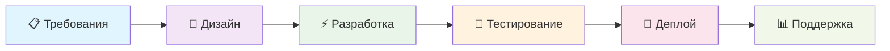

<!-- HEADER BANNER -->  <!-- PROJECT LOGO --> <div align="center"> <br/>  
# 🚀 ShaerWare Digital - Премиум разработка веб-сайтов и мобильных приложений

<div align="center">


**Превращаем идеи в мощные цифровые решения**

[](https://shaerware.digital/ru/)
[](https://kwork.ru/user/senior-php-developer)
[](#портфолио)
[](#о-нас)

[🌐 Наш сайт](https://shaerware.digital/ru/) • [📋 Портфолио](https://shaerware.digital/ru/proekty/) • [🛠️ Как я работаею](https://shaerware.digital/ru/how-we-work/) • [💬 Связаться с нами](#контакты)

---

</div>

## 🎯 Чем мы занимаемся

**Мы не просто пишем код — мы создаем цифровые продукты, которые приносят реальные бизнес-результаты.**

- 🌐 **Веб-разработка** - От лендингов до сложных enterprise-приложений
- 📱 **Мобильные приложения** - Нативные и кроссплатформенные решения  
- 🏗️ **SaaS-платформы** - Масштабируемые продукты на основе подписки
- 📊 **Интерактивные дашборды** - Визуализация данных и аналитика
- 🔧 **Кастомные скрипты и автоматизация** - Инструменты повышения эффективности
- 💼 **Техническое консультирование** - Проектирование архитектуры и code review

## 💻 Наш технологический арсенал

### **Backend-мастерство**


### **Frontend-совершенство**


### **Базы данных и DevOps**


## 🎭 Особенности этого проекта

Наш корпоративный сайт — это **полностью статичный HTML+CSS+JS проект** на GitHub Pages с несколькими интересными "фишками":

### 🎪 **Маскировка под WordPress**
```
📁 Структура каталогов и названия файлов имитируют WordPress
🎯 Создаёт иллюзию CMS, хотя сайт полностью статичный
🔒 Повышенная защита от ботов и сканеров уязвимостей
```

### 💬 **Telegram-чат на статическом сайте**
```javascript
// Онлайн-чат через Telegram на чистом JS
// Нонсенс для статичных сайтов? Мы это реализовали!
// Real-time связь без backend'а
```

### ⚡ **Производительность**
- ✅ 100% статика = мгновенная загрузка
- ✅ GitHub Pages = бесплатный хостинг
- ✅ Нет серверной части = максимальная безопасность
- ✅ SEO-оптимизация из коробки

## 🏆 Почему ShaerWare Digital?

<div align="center">

| 💡 **Инновации** | 🎯 **Результаты** | 🤝 **Партнёрство** |
|------------------|-----------------|-------------------|
| Передовые технологии | 100+ успешных проектов | Прозрачная коммуникация |
| AI-powered разработка | 98% довольных клиентов | Полная документация |
| Современные паттерны | Гарантия сроков | Поддержка после запуска |

</div>

## 📈 Наш процесс разработки



### 🔄 **Полный цикл разработки**
1. **Анализ и планирование** - Техническое задание и исследование требований
2. **Проектирование архитектуры** - Масштабируемые и поддерживаемые решения
3. **Agile-разработка** - Регулярные обновления и интеграция обратной связи
4. **Контроль качества** - Комплексное тестирование и оптимизация
5. **Деплой и запуск** - Плавный выход в продакшен
6. **Постоянная поддержка** - Сопровождение и добавление функций

## 💼 Портфолио

### 🌟 **Избранные проекты**

| Тип проекта | Описание | Стек технологий |
|------------|----------|-----------------|
| 🏪 **E-commerce платформа** | Маркетплейс с 10K+ товаров | Laravel, Vue.js, MySQL |
| 📊 **Аналитический дашборд** | Визуализация данных в реальном времени (50+ KPI) | PHP, Chart.js, PostgreSQL |
| 📱 **Мобильный банкинг** | Защищённая платформа финансовых транзакций | Java, React Native |
| 🎓 **Система управления обучением** | Образовательная платформа для 5000+ студентов | Laravel, MySQL, Redis |
| 🏥 **Медицинское управление** | Система записей пациентов и назначений | PHP, JavaScript, MySQL |

> **🔥 100+ проектов в нашем портфолио: финтех, здравоохранение, образование, ритейл и SaaS**

[📋 Посмотреть полное портфолио →](https://shaerware.digital/ru/proekty/)

## 📊 Цифры и факты

<div align="center">

| 📈 **Метрика** | 🎯 **Достижение** |
|---------------|-------------------|
| **Завершённых проектов** | 100+ |
| **Лет опыта** | 5+ |
| **Удовлетворённость клиентов** | 98% |
| **Освоенных технологий** | 15+ |
| **Размер команды** | 3-8 разработчиков |
| **Средняя длительность проекта** | 2-6 месяцев |

</div>

## 🌟 Истории успеха клиентов

> *"ShaerWare реализовали нашу SaaS-платформу с опережением графика. Их технические знания и понимание бизнеса помогли нам привлечь финансирование в размере $500K."*
> 
> **— Основатель IT-стартапа**

> *"E-commerce решение, которое они создали, обрабатывает 50K+ транзакций в месяц без сбоев. ROI превысил ожидания на 300%."*
> 
> **— Владелец розничного бизнеса**

## 🤝 Давайте создадим что-то удивительное вместе

### 🚀 **Готовы начать?**

Мы специализируемся на превращении сложных идей в успешные цифровые продукты. Будь вы стартап с MVP или крупное предприятие, нуждающееся в кастомных решениях — мы справимся.

### 📞 **Свяжитесь с нами**

- 🌐 **Сайт**: [shaerware.digital](https://shaerware.digital/ru/)
- 💼 **Профиль на Kwork**: [ТОП разработчик](https://kwork.ru/user/senior-php-developer)
- 📧 **Телеграм**: [shaerware](https://t.me/shaerware)
- 💬 **Консультация**: Бесплатная первичная оценка проекта

### 🎯 **Что мы предлагаем**

✅ **Бесплатная техническая консультация** - 30-минутный звонок  
✅ **Детальная оценка проекта** - Прозрачные сроки и стоимость  
✅ **Proof of Concept** - MVP для валидации идеи  
✅ **Full-scale разработка** - Enterprise-решения  
✅ **Долгосрочное сопровождение** - Партнёрство на годы  

## 📋 Есть требования к проекту?

**Мы поможем с:**
- 📝 Анализ технических требований
- 🏗️ Проектирование системной архитектуры  
- 📊 Выбор технологического стека
- ⏱️ Оценка сроков проекта
- 💰 Оптимизация бюджета
- 🔒 Аудит безопасности и соответствие стандартам

---

<div align="center">

## 📬 Контакты

### 🌐 **Основные каналы связи**

[](https://shaerware.digital/ru/)

[](https://t.me/shaerware)
[](https://twitter.com/shaerware)

[](https://kwork.ru/user/senior-php-developer)

---

### 🌟 **Присоединяйтесь к 100+ довольным клиентам**

**Готовы трансформировать свой бизнес с помощью передовых технологий?**

[](https://shaerware.digital/ru/)
[](https://shaerware.digital/ru/proekty/)

**⭐ Поставьте звезду этому репозиторию, если вам нравится наша работа!**

---

### 🏢 **О компании**

**ShaerWare Digital** - команда профессиональных разработчиков с опытом 5+ лет в создании веб и мобильных решений.

🎯 Специализация: Full-stack разработка, SaaS-платформы, Enterprise-приложения  
🏆 Достижения: 100+ завершённых проектов, ТОП рейтинг на Kwork  
💡 Технологии: PHP, Laravel, Java, JavaScript, React, Vue.js, Node.js  
🌍 География: Работаем с клиентами по всему миру  

---

<sup>© 2024 ShaerWare Digital. Профессиональная разработка веб-сайтов и мобильных приложений.</sup>

<sup>Сделано с ❤️ для бизнеса, который стремится к цифровому совершенству</sup>

</div>