# 🚀 ShaerWare Digital - Premium Web & Mobile Development

> **Transforming ideas into powerful digital solutions | 100+ successful projects | Full-cycle development from MVP to enterprise**

---

## 🎯 What We Do

**We don't just write code - we build digital products that drive real business results.**

- 🌐 **Web Development** - From landing pages to complex enterprise applications
- 📱 **Mobile Applications** - Native and cross-platform solutions  
- 🏗️ **SaaS Platforms** - Scalable subscription-based products
- 📊 **Interactive Dashboards** - Data visualization and analytics
- 🔧 **Custom Scripts & Automation** - Efficiency tools and integrations
- 💼 **Technical Consulting** - Architecture design and code review

## 💻 Our Tech Arsenal

### **Backend Excellence**

### **Frontend Mastery**

### **Database & DevOps**

## 🏆 Why Choose ShaerWare?

| 💡 **Innovation** | 🎯 **Results** | 🤝 **Partnership** |
|------------------|-----------------|-------------------|
| Cutting-edge tech solutions | 100+ successful deliveries | Transparent communication |
| AI-powered development | 98% client satisfaction | Full project documentation |
| Modern architecture patterns | On-time delivery guarantee | Post-launch support |

## 📈 Our Development Process

```mermaid
graph LR
    A[📋 Requirements] --> B[🎨 Design]
    B --> C[⚡ Development]
    C --> D[🧪 Testing]
    D --> E[🚀 Deployment]
    E --> F[📊 Support]
    
    style A fill:#e1f5fe
    style B fill:#f3e5f5
    style C fill:#e8f5e8
    style D fill:#fff3e0
    style E fill:#fce4ec
    style F fill:#f1f8e9
```

### 🔄 **Full-Cycle Excellence**
1. **Discovery & Planning** - Technical requirements analysis
2. **Architecture Design** - Scalable and maintainable solutions
3. **Agile Development** - Regular updates and feedback integration
4. **Quality Assurance** - Comprehensive testing and optimization
5. **Deployment & Launch** - Smooth production deployment
6. **Ongoing Support** - Maintenance and feature enhancements

## 💼 Portfolio Highlights

### 🌟 **Featured Projects**

| Project Type | Description | Tech Stack |
|--------------|-------------|------------|
| 🏪 **E-commerce Platform** | Multi-vendor marketplace with 10K+ products | Laravel, Vue.js, MySQL |
| 📊 **Analytics Dashboard** | Real-time data visualization for 50+ KPIs | PHP, Chart.js, PostgreSQL |
| 📱 **Mobile Banking App** | Secure financial transactions platform | Java, React Native |
| 🎓 **Learning Management System** | Educational platform for 5000+ students | Laravel, MySQL, Redis |
| 🏥 **Healthcare Management** | Patient records and appointment system | PHP, JavaScript, MySQL |

> **🔥 100+ more projects in our portfolio spanning fintech, healthcare, education, retail, and SaaS**

## 📊 By the Numbers

| 📈 **Metric** | 🎯 **Achievement** |
|---------------|-------------------|
| **Projects Completed** | 100+ |
| **Years of Experience** | 5+ |
| **Client Satisfaction** | 98% |
| **Technologies Mastered** | 15+ |
| **Team Size** | 3-8 developers |
| **Average Project Duration** | 2-6 months |

## 🌟 Client Success Stories

> *"ShaerWare delivered our SaaS platform ahead of schedule. Their technical expertise and business understanding helped us secure $500K in funding."*
> 
> **— Tech Startup Founder**

> *"The e-commerce solution they built handles 50K+ monthly transactions flawlessly. ROI exceeded expectations by 300%."*
> 
> **— Retail Business Owner**

## 🤝 Let's Build Something Amazing

### 🚀 **Ready to Start?**

We specialize in turning complex ideas into successful digital products. Whether you're a startup with an MVP or an enterprise needing custom solutions, we've got you covered.

### 📞 **Get In Touch**

- 🌐 **Website**: [shaerware.digital](https://shaerware.digital)
- 💼 **Kwork Profile**: [Top-Rated Developer](https://kwork.ru/user/senior-php-developer)
- 📧 **Email**: Contact through website form
- 💬 **Consultation**: Free initial project assessment

### 🎯 **What We Offer**

✅ **Free Technical Consultation** - 30-minute discovery call  
✅ **Detailed Project Estimation** - Transparent timeline and costs  
✅ **Proof of Concept** - MVP development for validation  
✅ **Full-Scale Development** - Enterprise-grade solutions  
✅ **Ongoing Maintenance** - Long-term partnership  

## 📋 Project Requirements?

**We help with:**
- 📝 Technical requirements analysis
- 🏗️ System architecture design  
- 📊 Technology stack selection
- ⏱️ Project timeline estimation
- 💰 Budget optimization
- 🔒 Security audit and compliance

---

### 🌟 **Join 100+ Satisfied Clients**

**Ready to transform your business with cutting-edge technology?**

**⭐ Star this repository if you find our work inspiring!**

---

© 2024 ShaerWare Digital. Professional web and mobile development services.
